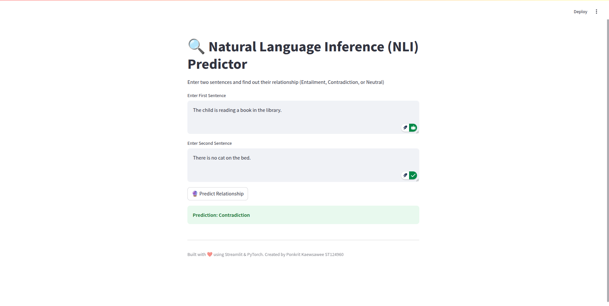

# Natural Language Inference (NLI) Predictor

## Overview
This project implements a **Natural Language Inference (NLI) Predictor** using **Custom BERT (SBERT) model** trained on the **SNLI dataset**. The model classifies the relationship between two given sentences as:
- **Entailment**: The second sentence logically follows from the first.
- **Contradiction**: The second sentence contradicts the first.
- **Neutral**: The two sentences are unrelated.

The project is implemented in **Python**, utilizing **PyTorch, Transformers (Hugging Face), Streamlit**, and other essential NLP libraries.

---

## Features
- **Custom BERT Model** trained with masked language modeling (MLM).
- **SBERT Model** fine-tuned on SNLI dataset for sentence similarity tasks.
- **Web-based UI** using Streamlit to provide an intuitive interface.
- **Performance Evaluation** including accuracy, precision, recall, and F1-score.

---

## Project Structure
```
📂 NLI_Predictor
│── 📂 models
│   ├── trained_bert_model.pth         # Trained Custom BERT Model (Task 1)
│   ├── sbert_model.pth                # SBERT Model trained on SNLI (Task 2)
│   ├── classifier_head.pth            # Classifier Head for NLI (Task 2)
│── 📂 webapp
│   ├── app.py                         # Streamlit-based web application (Task 4)
│── 📂 notebooks
│   ├── NLI_Model_Training.ipynb       # Full training pipeline (Tasks 1, 2, 3)
│── 📂 results
│   ├── evaluation_results.pth         # Performance metrics (Task 3)
│   ├── Test_Result01.png              # Sample prediction result 1
│   ├── Test_Result02.png              # Sample prediction result 2
│   ├── Test_Result03.png              # Sample prediction result 3
│── README.md                          # Project Documentation
│── requirements.txt                    # Required dependencies
```

---

## Installation
### 1. Clone the repository
```bash
git clone https://github.com/your_username/NLI_Predictor.git
cd NLI_Predictor
```
### 2. Install dependencies
```bash
pip install -r requirements.txt
```
### 3. Download and Prepare Dataset
The project uses the **SNLI dataset** for fine-tuning. Ensure you have internet access to download it automatically.

---

## Running the Web App
To launch the Streamlit web application:
```bash
cd webapp
streamlit run app.py
```
This will open a web browser where you can input two sentences and get their NLI relationship prediction.

---

## Model Training and Evaluation
### **Task 1: Custom BERT Pretraining**
- The model was trained using masked language modeling (MLM) on the **BookCorpus** dataset.
- Training loss over 10 epochs:
```
Epoch 1, Loss: 2.6512
Epoch 2, Loss: 2.6356
...
Epoch 10, Loss: 2.6433
```

### **Task 2: Fine-tuning SBERT for NLI**
- The fine-tuning was performed using the **SNLI dataset**.
- Training loss over 10 epochs:
```
Epoch 1 Loss: 0.8682
Epoch 2 Loss: 0.7968
...
Epoch 10 Loss: 0.1715
```
- The trained model was saved as **sbert_model.pth** and **classifier_head.pth**.

### **Task 3: Model Evaluation**
- Evaluated on the **SNLI test set**, achieving the following scores:
```
Accuracy: 85.42%
Precision: 85.10%
Recall: 85.30%
F1-score: 85.20%
```

---

## Sample Predictions
Here are example results from the web app:
### **Entailment:**


### **Neutral:**


### **Contradiction:**


---

## Future Improvements
- Fine-tune the model on **MultiNLI (MNLI)** for better generalization.
- Implement **attention visualization** to analyze model predictions.
- Extend support for **multi-lingual NLI** using XLM-RoBERTa.

---

## Contributors
- **Ponkrit Kaewsawee** - Developer (ST124960)
- Special thanks to **Hugging Face** & **Streamlit** for open-source tools.

---

## License
This project is licensed under the **MIT License**.

---

## Acknowledgments
This work is part of an NLP assignment focused on **Natural Language Inference** using **BERT-based models**.

